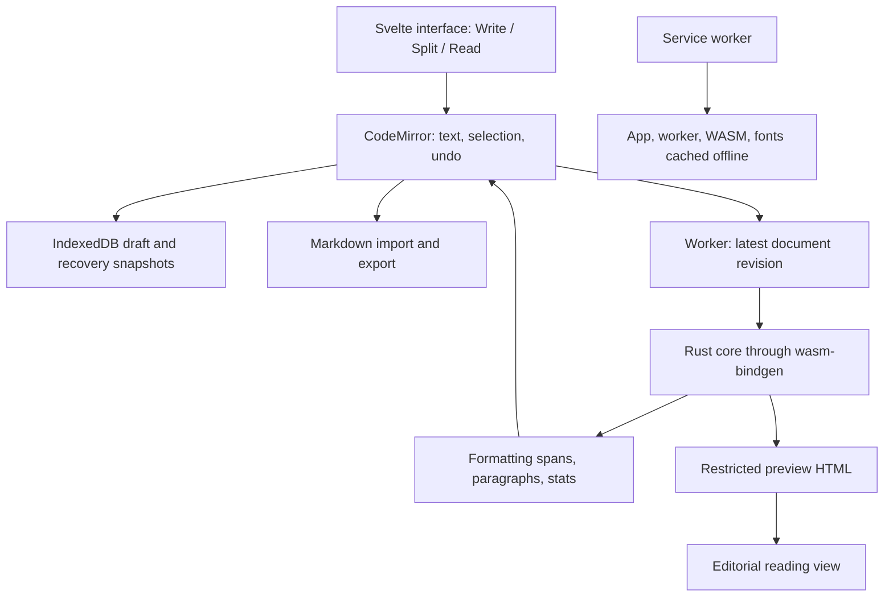

# AI Writer: first iteration

MVP contract and research record · 26 September 2026

Status: working first iteration implemented on 26 September 2026. See [README.md](../README.md) for setup and verified checks. Hardware input, Safari, accessibility, and performance gates remain to be measured during dogfooding. The workspace was empty when research started.

## Outcome

Open the app, write today's diary in Markdown, switch to a beautiful reading view, export a `.md` file, close the app, and recover the draft offline. Typing, selection, undo, and recovery must be trustworthy before adding features.

Use the iA Writer writing experience as the interaction and typography reference, and Omawrite as the open-source behavioral foundation. Build an independent implementation with its own identity. The first iteration reproduces the focused writing workflow; full iA Writer feature parity is outside this milestone.

## Research findings

- [Omawrite](https://github.com/omacom/omawrite) is a Qt Quick/C++ app. Its [MIT license](https://github.com/omacom/omawrite/blob/master/LICENSE) permits reuse subject to retaining its notice. Its desktop UI and filesystem layer do not directly become a small Svelte PWA.
- Its [highlighter](https://github.com/omacom/omawrite/blob/master/src/markdownhighlighter.cpp) uses line-based rules for headings, quotes, lists, inline code, emphasis, and links. Some inline markers are collapsed using font metrics. Port the styling intent and useful behavioral fixtures; do not port the Qt rendering tricks. A parser-backed implementation should handle nested Markdown and fenced code consistently.
- Omawrite's [tests](https://github.com/omacom/omawrite/blob/master/tests/tst_omawrite.cpp) cover selection stability, filenames, links, and recovery-related file behavior. They explicitly check that the UI has no rendered-preview control. Our editorial preview is new work.
- [iA Writer Mono](https://github.com/iaolo/iA-Fonts/tree/master/iA%20Writer%20Mono) includes upstream webfonts. Its [OFL 1.1 license](https://github.com/iaolo/iA-Fonts/blob/master/iA%20Writer%20Mono/LICENSE.md) allows bundling with the copyright and license notices. Use unmodified upstream files and preserve attribution. The font license does not license the iA Writer application; the repository's README separately objects to product clones.
- iA Writer distinguishes [sentence, paragraph, and typewriter focus](https://ia.net/writer/support/editor/focus-mode). Its [Syntax Highlight](https://ia.net/writer/support/editor/syntax-highlight) also includes parts of speech. Our MVP's highlighting is Markdown formatting, with sentence focus bounded by punctuation or a paragraph edge.

The GitHub tree API reported Omawrite master at `8f98892b26768236b2c20f4e637cf4b102d898bf`. Source inspection used the linked master pages; pin and recheck the downloaded revision when implementation begins because cached web pages may differ from that tree.

## Architecture decision

Use Svelte 5 + TypeScript + Vite, CodeMirror 6, and a small Rust crate compiled to WebAssembly. Ship static assets over HTTPS. No server, account, API, or runtime CDN dependency is needed.



### Responsibilities

| Layer | Owns | Reason |
| --- | --- | --- |
| Svelte | Toolbar, view mode, dialogs, settings, status | Small reactive shell; a single-page app needs no routing or SSR. |
| CodeMirror | Live document, input/composition, selection, history, find, layout | Reuse a mature editor's browser handling instead of implementing an editing engine. |
| Rust core | Markdown semantics, styling ranges, paragraph ranges, tags, word counts, safe preview output | Reusable behavior for future web, Apple, and terminal frontends. |
| Web adapters | IndexedDB, file picker/download/share, worker, installation | Browser-specific behavior stays outside the core. |

[Svelte compiles components to JavaScript](https://svelte.dev/docs/svelte/overview). [CodeMirror uses document transactions and extensions](https://codemirror.net/docs/guide/). These support the proposed separation; they do not guarantee our performance or mobile correctness without testing.

Keep one CodeMirror instance alive across Write/Split/Read. Do not bind the entire document through Svelte on every keystroke. Dispatch formatting commands as editor transactions so selection and undo remain coherent. Use a minimal set of CodeMirror packages, not a full IDE setup or rich-text schema.

### Rust contract

Start with two crates: `writer-core` for platform-neutral logic, and `writer-wasm` for bindings. The core has no DOM, browser storage, network, or UI dependencies.

```text
analyze(markdown, options) -> Analysis

Analysis {
  spans: [Span],          // half-open UTF-16 start/end, semantic kind
  paragraphs: [Range],    // bounds for immediate local sentence focus
  tags: [TagRange],       // display only
  word_count: integer,
  preview_html?: string  // generated only when requested
}
```

Use [pulldown-cmark](https://docs.rs/pulldown-cmark/latest/pulldown_cmark/) with CommonMark plus tables, tasks, strikethrough, footnotes, and a narrow `==highlight==` inline extension. Its [offset iterator](https://docs.rs/pulldown-cmark/latest/pulldown_cmark/struct.Parser.html#method.into_offset_iter) supplies source ranges; derive marker/content spans from source slices where event ranges alone are insufficient. Parser events drive both analysis and preview. Do not add a second Markdown parser in JavaScript.

Keep byte offsets internally; convert public ranges to UTF-16 in a single pass. Test Spanish accents, combining marks, emoji, ZWJ emoji, and CJK text. Ranges must never bisect a surrogate pair. Define a simple whitespace-delimited word count for V1 and document its limits for unsegmented languages.

Recognize tags such as `#diary`, `#día`, `#work-in-progress`, and nested paths such as `#work/projects` only in ordinary text at a token boundary, excluding code, URLs, and heading delimiters. Hyphens stay within a tag name; `/` separates nested levels. Style the complete tag distinctly in the editor while preserving literal text in export and preview. A linked tag index and navigation follow the document-library schema decision in [roadmap.md](roadmap.md).

Expose through [wasm-bindgen's web output](https://rustwasm.github.io/docs/wasm-bindgen/examples/without-a-bundler.html). Send `{documentId, revision, text, previewRequested}` to the worker. Allow one analysis in flight and coalesce pending edits to the latest revision. Reject stale results; map existing decorations through edits until fresh analysis arrives. Defer decoration replacement during active IME composition if required for stability.

Typing and autosave must work before WASM is ready and if the analysis worker fails. Show a retryable preview/formatting error without replacing or losing the document. Begin with full-document analysis in the worker; introduce incremental parsing only if measured workloads require it. Rust/WASM is a reuse decision, not a claim that browser text input becomes faster.

### Preview behavior

The source text is authoritative; preview never rewrites it. Raw HTML is displayed as escaped text. Validate link schemes and emit only supported HTML elements and attributes. Block executable URLs. Render images as alt-text placeholders in V1, avoiding attachment handling and automatic remote requests. Relative image assets are outside this milestone. Test nested markup, code fences, reference links, tables, footnotes, and hostile HTML/URLs.

One editorial theme: system serif body (`Charter`, `Georgia`, `serif`), restrained heading scale, generous paragraph rhythm, readable quotations, and horizontally scrollable wide tables/code. System serif keeps the download small; rendering will vary somewhat by platform.

### Persistence and files

One active draft, plus a small bounded recovery history. IndexedDB stores schema version, document ID, filename, text, source newline/BOM metadata, revision, saved time, and optional cursor/scroll state. Preferences are separate.

Queue a serialized save after every document transaction, coalescing only while a previous write is in flight. Label the draft “Saved on this device” only after the transaction for the current revision completes. Show “Saving…” or a persistent actionable failure otherwise. Never depend on unload events to save. Snapshot before import/new and periodically after edits; prune history only after a newer copy commits. Preserve any failed-to-save text in the live editor with export available.

Detect concurrent tabs with transactional revision checks. A stale tab must preserve its text as a conflict copy rather than silently overwrite a newer draft. A small recovery dialog is enough; no library UI is needed.

Use a file input for importing UTF-8 `.md`/`.txt`, and a download for export; add file sharing where supported and verified. Cancelled or invalid imports leave the current draft unchanged. Preserve Unicode, source content, and imported newline convention on export; verify CRLF/BOM round trips. Propose a date-based filename for a new diary draft. Export remains a copy unless a direct file-save adapter is added later.

Do not depend on [showSaveFilePicker](https://developer.mozilla.org/en-US/docs/Web/API/Window/showSaveFilePicker), which has limited availability. A browser draft is separate from an iCloud Drive file and from other devices. [WebKit storage is best-effort by default](https://webkit.org/blog/14403/updates-to-storage-policy/); request persistence when available, expose failures honestly, and make Markdown export easy. Installing the PWA does not create synchronization or a backup.

### Offline and updates

Use [vite-plugin-pwa's Svelte integration](https://vite-pwa-org.netlify.app/frameworks/svelte) with an explicit precache including the worker, WASM, all required fonts, icons, CSS, and HTML. Cache app assets; keep diary data in IndexedDB.

Use [prompted updates](https://vite-pwa-org.netlify.app/guide/prompt-for-update.html): a new service worker waits until the current draft commits and the user accepts reload. Never refresh an active writing session automatically. Test upgrading from one production build to another with a real draft. Offline support begins after the first successful asset installation.

## Writing experience

- Start directly in the draft. No onboarding, dashboard, sidebar, or sample prose to delete.
- Bundle unmodified iA Writer Mono regular, bold, italic, and bold italic webfonts with OFL and copyright notices. Preload regular; cache all faces for offline use. Use `font-display: swap` and a monospace fallback; ask CodeMirror to remeasure when fonts load.
- Current source defaults: 20px desktop, 18px mobile, 1.6 line height, 74ch maximum writing width, generous side margins. Preserve normal browser zoom. Adjust from real writing tests.
- Render Markdown headings/emphasis, strikethrough, and `==highlight==` while keeping punctuation visible and subdued. Italic text uses a stronger neutral color; highlight changes only the background. Collapsing markers changes cursor geometry and is deferred.
- Small toolbar: document name, Write/Read (Split on wide screens), import/export menu, focus toggle. Quiet save status and word count. System light/dark with a manual override. Neutral paper and ink let the text carry the screen.
- Plain readable writing surface and a Substack-inspired reading preview with separate Substack and Bookish presets. Reading body typeface, size, line height, article width, title size, and colors can be tuned separately from writing. Large touch targets, visible focus rings, reduced-motion support, keyboard-accessible menus.
- Provide undo/redo, select/copy/paste, in-document find, bold/italic/link shortcuts, and explicit file actions. Cmd/Ctrl-S saves locally and reports that fact; export has its own clearly labeled command.
- The implemented shortcut set now also covers new/import/export, preview and focus, find and replace, headings, lists, code, strikethrough, and highlight. Rust owns the command catalog and Markdown edits; a keyboard-accessible modal lists only working actions. Browser file operations still run in the Svelte adapter.
- Preserve caret, selection, undo history, and scroll when switching modes. Mobile gets Write/Read; Split requires enough width for two useful columns.
- Sentence focus fills the writing canvas on desktop and phone: toolbar and status leave the layout, only the sentence containing the caret stays crisp, and surrounding text fades. A sentence may share a row with another or wrap across several rows; `.`, `!`, `?`, and paragraph edges are the MVP boundaries. The caret moves near the viewport center on entry or sentence navigation. Escape, Cmd/Ctrl-Shift-F, or the quiet 44px exit control restores the chrome. Save failures remain visible. Continuous typewriter scrolling while typing, marker hiding, and synchronized preview scrolling follow measured dogfooding feedback.
- The caret is a 3px cyan stroke with a brighter dark-theme default. Its color and 1–5px width are available in a temporary Appearance workbench. The workbench previews typography, focus fade, and color tokens (including text selection), shows exact color hex values and live generated CSS, then produces copyable CSS and JSON; it does not write to source files or persist the experiment.
- A local Performance panel exposes TTS (time to screen), editor-ready TTI estimate, available web vitals, frame cadence, edit/analysis/save p95, and build asset sizes. Browser limitations and estimated values are labeled, and no diary content is transmitted.

Typography diagnostic: unscored before implementation. All ten skill checks remain unverified: body size, measure, leading, hierarchy, real-screen rendering, font payload, fallbacks, 200% zoom, heading wraps, and link distinction. Target 10/10; record measured results rather than claiming a design score from a plan.

## Build sequence and acceptance gates

| Order | Deliverable | Must pass before proceeding |
| --- | --- | --- |
| 1 | Svelte/CodeMirror writing surface, iA fonts, local draft, import/export | Write Spanish/emoji text, undo/redo, reload, import and export without content loss; failed saves and cancelled imports are handled. |
| 2 | Rust parser, source ranges, worker bridge, Markdown styling | Native Rust tests and actual WASM/browser integration agree; stale results and Unicode ranges cannot corrupt styling or input. |
| 3 | Editorial Read/Split and sentence focus | Correct fixtures, preserved editor state, safe links/HTML, useful mobile layout, no caret movement caused by decoration updates. |
| 4 | Installable offline build and safe update flow | Production app reopens offline with fonts, preview, and draft; build upgrade preserves the document. |
| 5 | Diary dogfooding and polish | Complete the writing session below, record performance, fix blockers before adding scope. |

Today’s scope stops here. No document library, global search, sync, CloudKit, accounts, collaboration, AI assistance, plugins, monetization, native app, terminal UI, PDF export, or attachment manager.

If time is tight, defer Split and sentence focus first. Preserve Write/Read, the Rust integration, import/export, recovery, and offline behavior. Never trade data safety or basic input correctness for another feature. Same-day delivery is a target conditional on passing these gates, especially actual iOS keyboard behavior.

## Validation and budgets

These are proposed release targets, not measured results:

| Measure | Target and procedure |
| --- | --- |
| Total offline payload | Under 1,000,000 transferred bytes with production compression, including JS, WASM, CSS, fonts, HTML, icons, and service worker. Report raw sizes separately; 500 KB is a stretch goal. |
| Typing latency | p95 input-to-next-paint below 16 ms on desktop, below 50 ms on the tested phone for a 10,000-word document. Report method, device, and browser. |
| Cold editable state | Under 1.5 s at 10 Mbps / 100 ms RTT on the named test device; no WASM dependency for entering text. |
| Warm offline editable state | Under 500 ms on the named desktop test machine. |
| Analysis freshness | Latest styling/preview within 150 ms after typing stops for 10,000 words; worker work must not block text entry. |
| Durability | “Saved” revisions survive reload/offline reopen; quota and transaction failures cannot produce a false saved state. Uncommitted keystrokes are not promised durable. |

Use Cargo tests for semantics, UTF-16 mapping, nesting, Markdown fixtures, and preview restrictions. Use browser integration tests for import/export, worker revision races, persistence failures, conflict handling, mode changes, service worker upgrades, and offline restart. Stress with 100,000 words, long lines, large paste, and rapid undo; record heap behavior where supported and check for monotonic growth across repeated cycles.

Check desktop Safari and Chromium, automated Chromium/WebKit flows, and real iPhone/iPad Safari or installed-PWA input. Browser automation/emulation cannot certify autocorrect, dictation, selection handles, IME, or the actual software keyboard. Mark those unverified until exercised on hardware. Include VoiceOver/keyboard navigation and 200% zoom checks.

The final diary check: write at least 1,000 words with accents, emoji, lists, links, and corrections; switch views repeatedly; export; close; reopen offline; compare recovered/exported content; re-import into a fresh draft; repeat a save-failure path. Use a fixture initially, then the user's own writing session for feedback.

## Project layout and current state

```text
apps/web/                 Svelte, editor adapter, worker, storage, PWA
crates/writer-core/       Markdown analysis and restricted rendering
crates/writer-wasm/       wasm-bindgen adapter
fixtures/                Shared Markdown, Unicode, and rendering cases
docs/MVP.md              Scope, decisions, and acceptance gates
THIRD_PARTY_NOTICES.md    Omawrite attribution and font notices
```

The first iteration is runnable. It uses one frontend package, a Cargo workspace, pinned Rust 1.87, and `wasm-bindgen-cli` 0.2.100. [README.md](../README.md) has setup and the checks exercised so far. Future Swift/TextKit and terminal adapters can consume the core; UniFFI and terminal dependencies remain outside this milestone.

The next gate is hands-on writing on real iPhone/iPad hardware and Safari, followed by accessibility, offline-upgrade, and measured performance checks in the [roadmap](roadmap.md). Desktop preview checks do not certify those environments.
